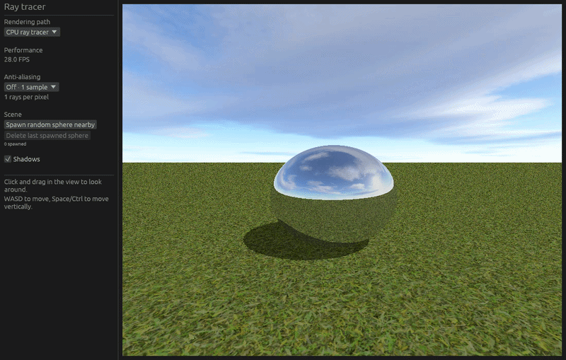

# Real-Time Ray Tracer

A small interactive ray tracer written in Rust. It includes two rendering backends: a multithreaded CPU renderer and a GPU renderer that traces rays in a `wgpu` shader and presents the result directly through the application window.

## Features

- Switch between CPU and GPU rendering from the settings panel.
- Render a ground plane and multiple spheres with materials, direct lighting, shadows, and reflections.
- Use bundled ground and sky textures in both renderers.
- Adjust supersampling from 1×1 (off) up to 4×4 samples per pixel.
- Toggle shadows and spawn or remove randomly colored spheres near the camera.
- View the current application frame rate in the settings panel.
- Navigate the scene with the mouse and keyboard.

The CPU backend uses Rayon to render image rows in parallel. The GPU backend traces and shades the scene in a `wgpu` fragment shader; rendered pixels remain on the GPU rather than being copied back to the CPU.

## Controls

| Input | Action |
| --- | --- |
| Click and drag in the viewport | Look around |
| W / A / S / D | Move |
| Space / Ctrl | Move up / down |
| Rendering path selector | Choose CPU or GPU |
| Anti-aliasing selector | Choose 1×1, 2×2, 3×3, or 4×4 samples per pixel |
| Shadows checkbox | Toggle shadows |
| Spawn random sphere nearby | Add a sphere in front of the camera |
| Delete last spawned sphere | Remove the most recently spawned sphere |

## Requirements

- Rust toolchain with support for the Rust 2024 edition.
- A graphics adapter and driver supported by `wgpu` to use GPU rendering. CPU rendering is available independently.

## Build and run

From the project directory:

```sh
cargo run --release
```

The release profile is recommended when comparing renderer performance. FPS depends on the selected renderer, sample count, scene size, display resolution, and hardware.

## Project layout

- `src/renderer/cpu/` — CPU frame rendering and shading.
- `src/renderer/gpu_viewport.rs` and `src/renderer/gpu_viewport.wgsl` — GPU resources, render callback, and ray-tracing shader.
- `src/renderer/world.rs` — shared camera, scene, and controls used by both backends.
- `src/ui/` — settings panel, CPU viewport, and shared viewport input.
- `src/scene.rs`, `src/objects/`, and `src/material.rs` — scene geometry and material data.
- `assets/` — bundled ground and sky textures.

## Demonstration


